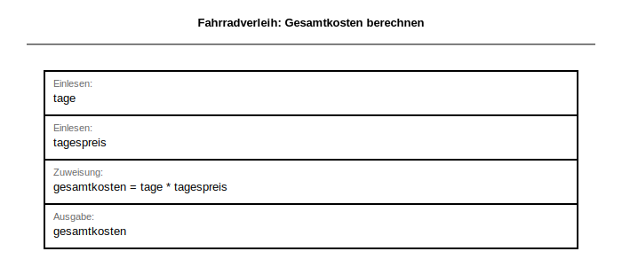

# Klassenarbeit (60 Minuten) – Lösung und Erwartungshorizont

**Klasse/Kurs:** BG12 | **Schuljahr:** 2025/2026 | **Bearbeitungszeit:** 60 Minuten | **Erreichbare Punkte:** 34

> **Hinweis:** Diese Fassung enthält Musterlösungen und Bewertungshinweise. Nur für Lehrkräfte.

---

## Struktur

| Teil | Inhalte | Punkte | Zeit |
|---|---|---:|---:|
| A | Theorie (MC) | 3 | 5 Min |
| B | EERM, Normalisierung, Anomalien | 14 | 25 Min |
| C | SQL-Abfragen über mehrere Tabellen | 14 | 25 Min |
| D | Grundlagen Programmierung (Struktogramm) | 3 | 5 Min |
| **Gesamt** |  | **34** | **60 Min** |

---

## Teil A (3 Punkte)

### Aufgabe 1: Theorie (Multiple Choice) – 3 Punkte
Markieren Sie richtig/falsch. (0,5 Punkte je Aussage)

| Nr. | Aussage | r/f |
|-----|---------|-----|
| 1 | Ein Fremdschlüssel darf mehrfach vorkommen. | |
| 2 | Eine N:M-Beziehung wird in relationalen Modellen direkt ohne Zwischentabelle gespeichert. | |
| 3 | Ein LEFT JOIN kann Datensätze ohne Partner auf der rechten Seite sichtbar machen. | |
| 4 | Die 3NF reduziert Redundanz und Anomalien. | |
| 5 | Ein Primärschlüssel darf NULL sein. | |
| 6 | HAVING filtert Gruppen nach GROUP BY. | |

**Musterlösung:** r, f, r, r, f, r

---

## Teil B (14 Punkte): EERM in MySQL Workbench

**Wichtig didaktisch:** Teil B ist eine reine Modellierungsaufgabe. Es wird bewusst kein fertiges SQL-Schema vorgegeben. Die Struktur muss selbst aus dem Sachverhalt entwickelt werden.

### Aufgabe 3.1: EERM modellieren – 8 Punkte

**Sachverhalt Modellierung (Kontext 1):**

Eine Bildungseinrichtung betreibt eine Kursplattform. Teilnehmende buchen Kurse zu konkreten Terminen. Lehrkräfte betreuen Kurse, zum Teil im Team. Die Schulleitung benötigt später Auswertungen zu Buchungen pro Person, Terminen pro Kurs und Lehrkräften ohne aktive Zuordnung.

**Auftrag:** Leiten Sie aus dem Sachverhalt ein geeignetes EERM in MySQL Workbench ab. Begründen Sie Ihre Modellierungsentscheidungen kurz.

**Bewertung (8 Punkte):**
- Entitätstypen korrekt identifiziert (Teilnehmende, Kurse, Termine, Lehrkräfte, Buchungen): 2 Pkt
- Beziehungen korrekt (N:M-Auflösungen, 1:N): 3 Pkt
- Kardinalitäten korrekt angegeben: 1 Pkt
- Attributzuweisung sinnvoll, PKs und FKs korrekt: 2 Pkt

**Referenzmodell:** `kursplattform_2025.mwb`

### Aufgabe 3.2: Normalisierung bis 3NF – 4 Punkte

**Musterlösung (Beispiel):**
- FA1: `termin_id → kurs_id` (jeder Termin gehört zu einem Kurs)
- FA2: `buchung_id → teilnehmer_id, termin_id` (jede Buchung identifiziert Teilnehmer und Termin)
- Das Modell liegt in 3NF, weil: kein Attribut hängt transitiv von einem Nicht-Schlüssel ab (alle Nicht-Schlüssel-Attribute hängen direkt von den PKs ab).

**Bewertung:** je 1 Pkt pro korrekte FA (2 Pkt) + Begründung 3NF (2 Pkt)

### Aufgabe 3.3: Anomalien – 2 Punkte

**Musterlösung:**
- Einfügeanomalie: Ein neuer Kurs kann erst angelegt werden, wenn mindestens ein Termin bekannt ist (falls Kursdaten nur über Terminrelation gespeichert).
- Änderungsanomalie: Wird der Kursname in einer denormalisierten Tabelle geaendert, muss er in allen Buchungszeilen angepasst werden.
- Löschanomalie: Wird der letzte Termin eines Kurses gelöscht, gehen alle Kursinformationen verloren.

**Bewertung:** je 0,5 Pkt pro Beispiel (max. 2 Pkt für je ein sinnvolles Beispiel)

---

## Teil C (14 Punkte): SQL-Abfragen über mehrere Tabellen

**Separater SQL-Kontext (3NF, Kontext 2) – anderen Kontext als Modellierung:**
Für Teil C wird absichtlich einen anderen Kontext verwendet als in Teil B (Kontext 1), damit die Modellierungslösung aus Teil B nicht indirekt vorgegeben wird.
Die didaktische Trennung ist essenziell für die Unabhaengigkeit der Aufgabenteile.

**Konkreter Sachverhalt:**
Ein kommunaler Stadtfahrradverleih verwaltet Kundinnen und Kunden, Stationen, Fahrräder, Ausleihen, Zahlungen und Wartungen (6 Entitätstypen). Die bereitgestellte Übungsdatenbank ist bereits in 3NF modelliert.

**Arbeitsgrundlage:**
- SQL-Struktur: `stadtfahrradverleih_struktur_2025.sql`
- SQL-Daten: `stadtfahrradverleih_daten_2025.sql`
- EERM-Referenzgrafik: `stadtfahrradverleih_2025.png`


### Aufgabe 4.1 (4 Punkte)
Geben Sie für jede abgeschlossene Ausleihe den Kundennamen, die Fahrradnummer, den Fahrradtyp, Start- und Zielstation sowie den Zahlbetrag aus. Sortierung: Kundennachname, Startzeit.

**Musterlösung:**
```sql
SELECT
  k.nachname, k.vorname,
  f.fahrrad_id,
  f.typname,
  s1.stationsname AS startstation,
  s2.stationsname AS zielstation,
  z.betrag
FROM ausleihen a
JOIN kunden k ON a.kunde_id = k.kunde_id
JOIN fahrraeder f ON a.fahrrad_id = f.fahrrad_id
JOIN stationen s1 ON a.start_station_id = s1.station_id
JOIN stationen s2 ON a.ziel_station_id = s2.station_id
JOIN zahlungen z ON a.ausleihe_id = z.ausleihe_id
WHERE a.status = 'abgeschlossen'
ORDER BY k.nachname, a.startzeit;
```
**Bewertung:** JOIN-Kette vollständig 2 Pkt | WHERE korrekt 1 Pkt | ORDER BY korrekt 1 Pkt

### Aufgabe 4.2 (4 Punkte)
Ermitteln Sie je Kundin/Kunde die Anzahl abgeschlossener Ausleihen. Zeigen Sie nur Personen mit mindestens 2 abgeschlossenen Ausleihen.

**Musterlösung:**
```sql
SELECT k.nachname, k.vorname, COUNT(a.ausleihe_id) AS anzahl_ausleihen
FROM kunden k
JOIN ausleihen a ON k.kunde_id = a.kunde_id
WHERE a.status = 'abgeschlossen'
GROUP BY k.kunde_id, k.nachname, k.vorname
HAVING COUNT(a.ausleihe_id) >= 2
ORDER BY anzahl_ausleihen DESC;
```
**Bewertung:** GROUP BY 1 Pkt | HAVING korrekt 2 Pkt | Spaltenselektion 1 Pkt

### Aufgabe 4.3 (3 Punkte)
Geben Sie pro Station den letzten Ausleihstart und die Anzahl unterschiedlicher Kundinnen/Kunden aus, die dort gestartet sind.

**Musterlösung:**
```sql
SELECT
  s.stationsname,
  MAX(a.startzeit) AS letzter_start,
  COUNT(DISTINCT a.kunde_id) AS unterschiedliche_kunden
FROM stationen s
JOIN ausleihen a ON s.station_id = a.start_station_id
GROUP BY s.station_id, s.stationsname;
```
**Bewertung:** MAX korrekt 1 Pkt | COUNT DISTINCT 1 Pkt | GROUP BY korrekt 1 Pkt

### Aufgabe 4.4 (3 Punkte)
Finden Sie Fahrräder ohne dokumentierte Wartung (LEFT JOIN).

**Musterlösung:**
```sql
SELECT f.fahrrad_id, f.typname, f.seriennummer
FROM fahrraeder f
LEFT JOIN wartungen w ON f.fahrrad_id = w.fahrrad_id
WHERE w.wartung_id IS NULL;
```
**Bewertung:** LEFT JOIN korrekt 1,5 Pkt | IS NULL Bedingung korrekt 1,5 Pkt

---

## Teil D (3 Punkte): Grundlagen Programmierung

### Aufgabe: Struktogramm – Fahrradverleih Kostenberechnung

Ein Kunde möchte wissen, wie viel eine Fahrradausleihe kostet.
Erstellen Sie ein **Struktogramm** (gemäß Operatorenliste für Struktogramme) für folgende Verarbeitung:

- **Eingabe:** Anzahl der Ausleih-Tage und Tagespreis in Euro
- **Verarbeitung:** Berechnung der Gesamtkosten
- **Ausgabe:** Gesamtkosten in Euro

**Hinweis:** Verwenden Sie ausschließlich Sequenz-Blöcke (EVA-Prinzip).
Kontrollstrukturen (Schleifen, Verzweigungen) werden **nicht** bewertet und sind nicht erforderlich.

| Bewertungskriterium | Punkte |
|---|---:|
| Struktogramm-Rahmen (ANFANG/ENDE) und 3 Sequenzblöcke vollständig | 1,0 |
| Berechnungsformel korrekt (Zuweisung mit :=) | 1,5 |
| Variablennamen und Lesbarkeit | 0,5 |
| **Gesamt** | **3,0** |

**Musterlösung (Text-Notation gemäß Operatorenliste):**
```
ANFANG
  EINGABE: tage
  EINGABE: tagespreis
  gesamtkosten := tage * tagespreis
  AUSGABE: gesamtkosten
ENDE
```

**Struktogramm (BW-Standard, generiert):**



**Bewertungshinweise:**
- 1,0 Pkt: ANFANG/ENDE vorhanden, 4 Sequenzblöcke sauber abgegrenzt (je 0,25 Pkt)
- 1,5 Pkt: Zuweisung `gesamtkosten := tage * tagespreis` korrekt (Operator := und Formel je 0,75 Pkt)
- 0,5 Pkt: Variablennamen aussagekräftig und einheitlich

---

## Abgabe

- EERM-Modellierung Teil B (von Schuelern erstellt): als `.mwb`-Datei abgeben
- SQL-Lösungen Teil C: als Datei oder Text

---

## Kurzloesungsschluessel (Lehrkraft)

Aufgabe 1: r, f, r, r, f, r

Lösungshinweise Teil C:
- 4.1 benötigt JOIN über mindestens: ausleihen, kunden, fahrraeder, stationen (2x), zahlungen
- 4.2 benötigt GROUP BY/HAVING auf kunden + ausleihen
- 4.3 benötigt Aggregation pro station + MAX(startzeit)
- 4.4 benötigt LEFT JOIN fahrraeder -> wartungen und IS NULL
