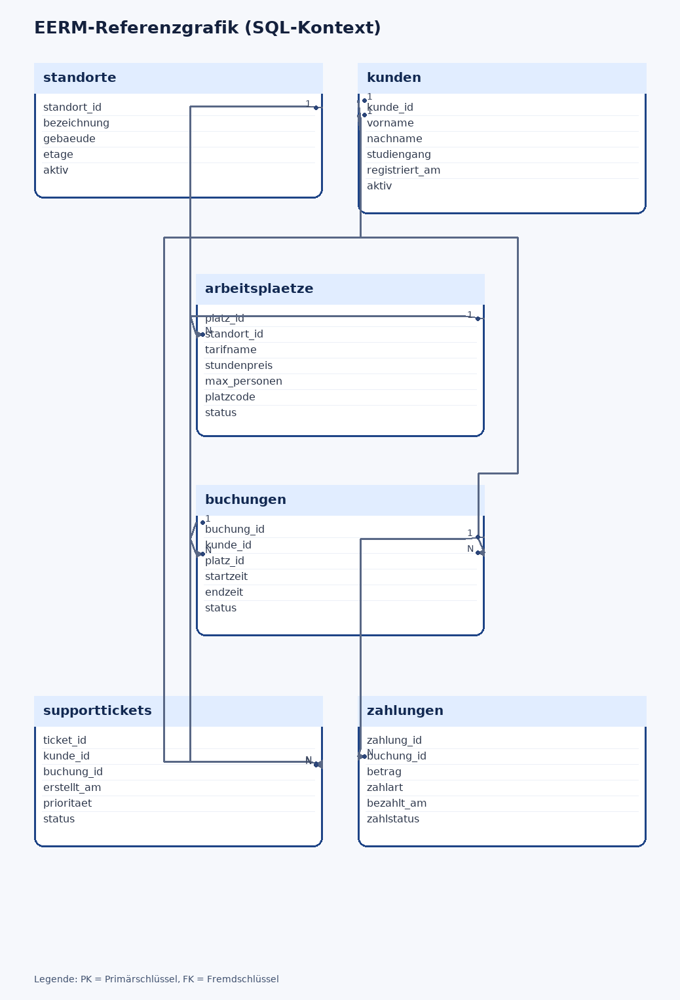

# Klassenarbeit (60 Minuten) – VERSION2

**Klasse/Kurs:** BG12 | **Schuljahr:** 2025/2026 | **Bearbeitungszeit:** 60 Minuten | **Erreichbare Punkte:** 34

---

## Struktur

| Teil | Inhalte | Punkte | Zeit |
|---|---|---:|---:|
| A | Theorie (MC) | 3 | 5 Min |
| B | EERM, Normalisierung, Anomalien | 14 | 25 Min |
| C | SQL-Abfragen ueber mehrere Tabellen | 14 | 25 Min |
| D | Grundlagen Programmierung (Struktogramm) | 3 | 5 Min |
| **Gesamt** |  | **34** | **60 Min** |

---

## Teil A (3 Punkte)

### Aufgabe 1: Theorie (Multiple Choice) – 3 Punkte
Markieren Sie richtig/falsch. (0,5 Punkte je Aussage)

| Nr. | Aussage | r/f |
|-----|---------|-----|
| 1 | Eine Entität kann mehrere Beziehungen besitzen. | |
| 2 | Eine Fremdschlüsselspalte darf nur NULL-Werte enthalten. | |
| 3 | `GROUP BY` bündelt Datensätze nach Attributwerten. | |
| 4 | Die 3NF verhindert viele Redundanzen im Datenmodell. | |
| 5 | `LEFT JOIN` zeigt immer nur Datensätze mit Partner an. | |
| 6 | `HAVING` filtert gruppierte Ergebnisse. | |

---

## Teil B (14 Punkte): EERM in MySQL Workbench

**Wichtig:** Teil B ist eine reine Modellierungsaufgabe. Es wird bewusst kein fertiges SQL-Schema vorgegeben.

### Aufgabe 3.1: EERM modellieren – 8 Punkte

**Sachverhalt Modellierung (Kontext 1):**

Ein schulisches Lernlabor organisiert projektbasierte Workshops. Lernende buchen Workshops, Teams nutzen Geräte in Zeitslots, und Coachs begleiten mehrere Teams parallel. Die Schulleitung möchte später Auswertungen zu Auslastung, Teamaktivität und Coach-Einsätzen.

**Auftrag:** Leiten Sie aus dem Sachverhalt ein geeignetes EERM in MySQL Workbench ab. Begründen Sie Ihre Modellierungsentscheidungen kurz.

### Aufgabe 3.2: Normalisierung bis 3NF – 4 Punkte
- Benennen Sie 2 funktionale Abhängigkeiten.
- Begründen Sie, warum das Modell in 3NF liegt.

### Aufgabe 3.3: Anomalien – 2 Punkte
Nennen Sie je ein Beispiel:
- Einfügeanomalie
- Änderungsanomalie
- Löschanomalie

---

## Teil C (14 Punkte): SQL-Abfragen ueber mehrere Tabellen

**Separater SQL-Kontext (3NF, Kontext 2) – anderen Kontext als Modellierung:**
Für Teil C wird absichtlich ein anderen Kontext verwendet als in Teil B (Kontext 1), damit die Modellierungslösung aus Teil B nicht indirekt vorgegeben wird.

**Konkreter Sachverhalt:**
Ein Campus-Coworking-System verwaltet Kundinnen und Kunden, Standorte, Arbeitsplaetze, Buchungen, Zahlungen und Supporttickets (6 Entitaetstypen).

**Arbeitsgrundlage:**
- SQL-Struktur: `coworkingcampus_struktur_2025.sql`
- SQL-Daten: `coworkingcampus_daten_2025.sql`
- EERM-Referenzgrafik: `coworkingcampus_2025.png`

### Aufgabe 4.1 (4 Punkte)
Geben Sie für jede abgeschlossene Buchung den Kundennamen, Platzcode, Standort, Tarifnamen und Zahlbetrag aus.
Sortierung: Nachname, Startzeit.

### Aufgabe 4.2 (4 Punkte)
Ermitteln Sie je Kundin/Kunde die Anzahl abgeschlossener Buchungen. Zeigen Sie nur Personen mit mindestens 2 abgeschlossenen Buchungen.

### Aufgabe 4.3 (3 Punkte)
Geben Sie pro Standort den letzten Buchungsstart und die Anzahl unterschiedlicher Kundinnen/Kunden aus, die dort gebucht haben.

### Aufgabe 4.4 (3 Punkte)
Finden Sie Kundinnen/Kunden ohne Supportticket (LEFT JOIN).

---

## Teil D (3 Punkte): Grundlagen Programmierung

### Aufgabe 2: Struktogramm (am Ende bearbeiten)
Erstellen Sie ein Struktogramm für folgende Logik (BPE 5.1):
- Eingabe: Anzahl gebuchter Stunden
- Gültig sind Werte von 1 bis 12
- Bei ungültiger Eingabe erneut abfragen
- Bei gültiger Eingabe: "Wert gültig"

**Wichtig:** Keine Arrays und keine Listen verwenden.

Bewertung: Logik 1,5 Pkt | Strukturbloecke 1,0 Pkt | Lesbarkeit 0,5 Pkt

---

## Abgabe

- EERM-Modellierung Teil B (von Schülern erstellt): als `.mwb`-Datei abgeben
- SQL-Lösungen Teil C: als Datei oder Text
