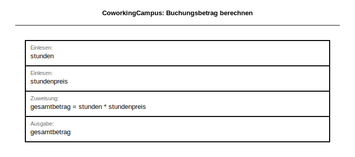

# Klassenarbeit (60 Minuten) – VERSION2 Lösung und Erwartungshorizont

**Klasse/Kurs:** BG12 | **Schuljahr:** 2025/2026 | **Bearbeitungszeit:** 60 Minuten | **Erreichbare Punkte:** 34

> **Hinweis:** Diese Fassung enthält Musterlösungen und Bewertungshinweise.

---

## Struktur

| Teil | Inhalte | Punkte | Zeit |
|---|---|---:|---:|
| A | Theorie (MC) | 3 | 5 Min |
| B | EERM, Normalisierung, Anomalien | 14 | 25 Min |
| C | SQL-Abfragen über mehrere Tabellen | 14 | 25 Min |
| D | Grundlagen Programmierung (Struktogramm) | 3 | 5 Min |
| **Gesamt** |  | **34** | **60 Min** |

---

## Teil A (3 Punkte)

### Aufgabe 1: Theorie (Multiple Choice) – 3 Punkte
**Musterlösung:** r, f, r, r, f, r

---

## Teil B (14 Punkte): EERM in MySQL Workbench

### Aufgabe 3.1: EERM modellieren – 8 Punkte
**Bewertung (8 Punkte):**
- Entitätstypen korrekt identifiziert: 2 Pkt
- Beziehungen korrekt (inkl. N:M-Auflösung): 3 Pkt
- Kardinalitäten korrekt angegeben: 1 Pkt
- Attributzuweisung, PK/FK korrekt: 2 Pkt

**Referenzmodell:** `lernlabor_2025.mwb`

### Aufgabe 3.2: Normalisierung bis 3NF – 4 Punkte
**Musterlösung (Beispiel):**
- `slot_id -> geraet_id`
- `buchung_id -> team_id, slot_id`
- 3NF erfüllt, da Nichtschlüsselattribute direkt vom Primärschlüssel abhängen.

**Bewertung:** je 1 Pkt pro korrekte FA (2 Pkt) + 3NF-Begründung (2 Pkt)

### Aufgabe 3.3: Anomalien – 2 Punkte
**Musterlösung:**
- Einfügeanomalie: Neues Gerät erst erfassbar, wenn ein Slot existiert.
- Änderungsanomalie: Raumbezeichnung muss in mehreren Zeilen geändert werden.
- Löschanomalie: Letzter Slot gelöscht, Gerätedaten gehen verloren.

---

## Teil C (14 Punkte): SQL-Abfragen über mehrere Tabellen

**Separater SQL-Kontext (3NF, Kontext 2) – anderen Kontext als Modellierung:**
Für Teil C wird absichtlich ein anderen Kontext verwendet als in Teil B (Kontext 1), damit die Modellierungslösung aus Teil B nicht indirekt vorgegeben wird.

**Arbeitsgrundlage:**
- SQL-Struktur: `coworkingcampus_struktur_2025.sql`
- SQL-Daten: `coworkingcampus_daten_2025.sql`
- EERM-Referenzgrafik: `coworkingcampus_2025.png`


### Aufgabe 4.1 (4 Punkte) – Musterlösung
```sql
SELECT
  k.nachname,
  k.vorname,
  a.platzcode,
  s.bezeichnung AS standort,
  a.tarifname,
  z.betrag
FROM buchungen b
JOIN kunden k ON b.kunde_id = k.kunde_id
JOIN arbeitsplaetze a ON b.platz_id = a.platz_id
JOIN standorte s ON a.standort_id = s.standort_id
JOIN zahlungen z ON b.buchung_id = z.buchung_id
WHERE b.status = 'abgeschlossen'
ORDER BY k.nachname, b.startzeit;
```
**Bewertung:** JOIN-Kette 2 Pkt | WHERE 1 Pkt | ORDER BY 1 Pkt

### Aufgabe 4.2 (4 Punkte) – Musterlösung
```sql
SELECT k.nachname, k.vorname, COUNT(b.buchung_id) AS anzahl_buchungen
FROM kunden k
JOIN buchungen b ON k.kunde_id = b.kunde_id
WHERE b.status = 'abgeschlossen'
GROUP BY k.kunde_id, k.nachname, k.vorname
HAVING COUNT(b.buchung_id) >= 2
ORDER BY anzahl_buchungen DESC;
```
**Bewertung:** GROUP BY 1 Pkt | HAVING 2 Pkt | Spaltenselektion 1 Pkt

### Aufgabe 4.3 (3 Punkte) – Musterlösung
```sql
SELECT
  s.bezeichnung,
  MAX(b.startzeit) AS letzter_start,
  COUNT(DISTINCT b.kunde_id) AS unterschiedliche_kunden
FROM standorte s
JOIN arbeitsplaetze a ON s.standort_id = a.standort_id
JOIN buchungen b ON a.platz_id = b.platz_id
GROUP BY s.standort_id, s.bezeichnung;
```
**Bewertung:** MAX 1 Pkt | COUNT DISTINCT 1 Pkt | GROUP BY 1 Pkt

### Aufgabe 4.4 (3 Punkte) – Musterlösung
```sql
SELECT k.kunde_id, k.vorname, k.nachname
FROM kunden k
LEFT JOIN supporttickets st ON k.kunde_id = st.kunde_id
WHERE st.ticket_id IS NULL;
```
**Bewertung:** LEFT JOIN 1,5 Pkt | IS NULL 1,5 Pkt

---

## Teil D (3 Punkte): Grundlagen Programmierung

### Aufgabe: Struktogramm – CoworkingCampus Buchungsbetrag

Eine Bucherin möchte wissen, wie viel ihre Buchung im CoworkingCampus kostet.
Erstellen Sie ein **Struktogramm** (gemäß Operatorenliste für Struktogramme) für folgende Verarbeitung:

- **Eingabe:** Anzahl gebuchter Stunden und Stundenpreis in Euro
- **Verarbeitung:** Berechnung des Gesamtbetrags
- **Ausgabe:** Gesamtbetrag in Euro

**Hinweis:** Verwenden Sie ausschließlich Sequenz-Blöcke (EVA-Prinzip).
Kontrollstrukturen (Schleifen, Verzweigungen) werden **nicht** bewertet und sind nicht erforderlich.

| Bewertungskriterium | Punkte |
|---|---:|
| Struktogramm-Rahmen (ANFANG/ENDE) und 3 Sequenzblöcke vollständig | 1,0 |
| Berechnungsformel korrekt (Zuweisung mit :=) | 1,5 |
| Variablennamen und Lesbarkeit | 0,5 |
| **Gesamt** | **3,0** |

**Musterlösung (Text-Notation gemäß Operatorenliste):**
```
ANFANG
  EINGABE: stunden
  EINGABE: stundenpreis
  gesamtbetrag := stunden * stundenpreis
  AUSGABE: gesamtbetrag
ENDE
```

**Struktogramm (BW-Standard, generiert):**



**Bewertungshinweise:**
- 1,0 Pkt: ANFANG/ENDE vorhanden, 4 Sequenzblöcke sauber abgegrenzt (je 0,25 Pkt)
- 1,5 Pkt: Zuweisung `gesamtbetrag := stunden * stundenpreis` korrekt (Operator := und Formel je 0,75 Pkt)
- 0,5 Pkt: Variablennamen aussagekräftig und einheitlich
