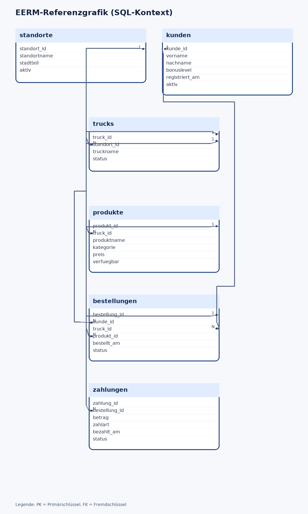

# Klassenarbeit (60 Minuten) – VERSION3 Lösung und Erwartungshorizont

**Klasse/Kurs:** BG12 | **Schuljahr:** 2025/2026 | **Bearbeitungszeit:** 60 Minuten | **Erreichbare Punkte:** 34

> **Hinweis:** Diese Fassung enthält Musterlösungen und Bewertungshinweise.

---

## Struktur

| Teil | Inhalte | Punkte | Zeit |
|---|---|---:|---:|
| A | Theorie (MC) | 3 | 5 Min |
| B | EERM, Normalisierung, Anomalien | 14 | 25 Min |
| C | SQL-Abfragen ueber mehrere Tabellen | 14 | 25 Min |
| D | Grundlagen Programmierung (Struktogramm) | 3 | 5 Min |
| **Gesamt** |  | **34** | **60 Min** |

---

## Teil A (3 Punkte)

### Aufgabe 1: Theorie (Multiple Choice) – 3 Punkte
**Musterlösung:** r, f, r, r, r, f

---

## Teil B (14 Punkte): EERM in MySQL Workbench

### Aufgabe 3.1: EERM modellieren – 8 Punkte
**Bewertung (8 Punkte):**
- Entitätstypen korrekt identifiziert: 2 Pkt
- Beziehungen korrekt (inkl. N:M-Auflösung): 3 Pkt
- Kardinalitäten korrekt angegeben: 1 Pkt
- Attributzuweisung, PK/FK korrekt: 2 Pkt

**Referenzmodell:** `startupwerkstatt_2025.mwb`

### Aufgabe 3.2: Normalisierung bis 3NF – 4 Punkte
**Musterlösung (Beispiel):**
- `termin_id -> mentor_id`
- `pitch_id -> team_id, termin_id`
- 3NF erfüllt, da keine transitiven Abhängigkeiten zwischen Nichtschlüsselattributen bestehen.

### Aufgabe 3.3: Anomalien – 2 Punkte
**Musterlösung:**
- Einfügeanomalie: Mentorprofil erst möglich, wenn ein Termin erfasst wurde.
- Änderungsanomalie: Raumname an mehreren Stellen zu ändern.
- Löschanomalie: Letzter Termin gelöscht, Mentorzuordnung geht verloren.

---

## Teil C (14 Punkte): SQL-Abfragen ueber mehrere Tabellen

**Separater SQL-Kontext (3NF, Kontext 2) – anderen Kontext als Modellierung:**
Für Teil C wird absichtlich ein anderen Kontext verwendet als in Teil B (Kontext 1), damit die Modellierungslösung aus Teil B nicht indirekt vorgegeben wird.

**Arbeitsgrundlage:**
- SQL-Struktur: `foodtrucknetz_struktur_2025.sql`
- SQL-Daten: `foodtrucknetz_daten_2025.sql`
- EERM-Referenzgrafik: `foodtrucknetz_2025.png`



### Aufgabe 4.1 (4 Punkte) – Musterlösung
```sql
SELECT
  k.nachname,
  k.vorname,
  t.truckname,
  s.standortname,
  z.betrag
FROM bestellungen b
JOIN kunden k ON b.kunde_id = k.kunde_id
JOIN trucks t ON b.truck_id = t.truck_id
JOIN standorte s ON t.standort_id = s.standort_id
JOIN zahlungen z ON b.bestellung_id = z.bestellung_id
WHERE b.status = 'abgeschlossen'
ORDER BY k.nachname, b.bestellt_am;
```

### Aufgabe 4.2 (4 Punkte) – Musterlösung
```sql
SELECT k.nachname, k.vorname, COUNT(b.bestellung_id) AS anzahl_bestellungen
FROM kunden k
JOIN bestellungen b ON k.kunde_id = b.kunde_id
WHERE b.status = 'abgeschlossen'
GROUP BY k.kunde_id, k.nachname, k.vorname
HAVING COUNT(b.bestellung_id) >= 2
ORDER BY anzahl_bestellungen DESC;
```

### Aufgabe 4.3 (3 Punkte) – Musterlösung
```sql
SELECT
  s.standortname,
  MAX(b.bestellt_am) AS letzter_zeitpunkt,
  COUNT(DISTINCT b.kunde_id) AS unterschiedliche_kunden
FROM standorte s
JOIN trucks t ON s.standort_id = t.standort_id
JOIN bestellungen b ON t.truck_id = b.truck_id
GROUP BY s.standort_id, s.standortname;
```

### Aufgabe 4.4 (3 Punkte) – Musterlösung
```sql
SELECT p.produkt_id, p.produktname, p.kategorie
FROM produkte p
LEFT JOIN bestellungen b ON p.produkt_id = b.produkt_id
WHERE b.bestellung_id IS NULL;
```

---

## Teil D (3 Punkte): Grundlagen Programmierung

### Aufgabe 2: Struktogramm – Musterlösung
```
ANFANG
  EINGABE: menues
  SOLANGE menues < 0 ODER menues > 30:
      AUSGABE: "Ungültige Eingabe, bitte wiederholen"
      EINGABE: menues
  AUSGABE: "Eingabe gültig"
ENDE
```

**Bewertung:** Logik 1,5 Pkt | Strukturbloecke 1,0 Pkt | Lesbarkeit 0,5 Pkt
